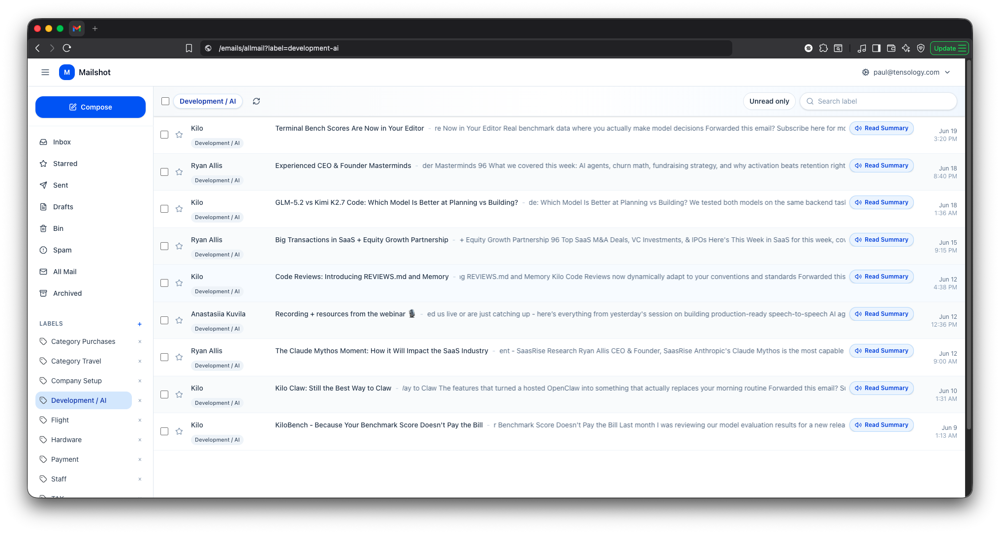

# Mailshot

<p align="center">
  
</p>

<p align="center">
  A self-hosted Gmail-style mailbox starter for people who want mail on their own server instead of relying on Google Workspace for the Gmail interface.
</p>

<p align="center">
  
  
  
  
  <a href="LICENSE"></a>
</p>

<p align="center">
  <a href="#features"><strong>Features</strong></a> ·
  <a href="#how-it-works"><strong>How It Works</strong></a> ·
  <a href="#settings"><strong>Settings</strong></a> ·
  <a href="#installation"><strong>Install</strong></a> ·
  <a href="#running-locally"><strong>Run Locally</strong></a>
</p>

---

## Features

| | Feature | Description |
|---|---|---|
| Mail | **Mailbox triage** | Inbox, starred, sent, drafts, bin, spam, all mail, archived mail, and custom category views |
| Tags | **Categories and labels** | Move messages into categories, browse a label from the sidebar, and keep future mail organized with label rules |
| Bulk | **Page and full-scope selection** | Select one message, a page of messages, or every matching message across a mailbox/search |
| Undo | **Safe deletion flow** | Move mail to Bin with an undo snackbar, then permanently delete from Bin when needed |
| AI | **Read Summary** | Generate a short LLM summary for an email and play it back from the list or message view |
| Voice | **Kokoro TTS** | Convert summaries into audio with selectable Kokoro voices in Settings |
| Settings | **Per-address signatures** | Manage signatures and auto responders per sender address without leaving the mailbox |
| Providers | **Configurable AI provider** | Use NVIDIA, OpenAI, Anthropic, OpenRouter, or Kilo Code with provider-specific API keys and model selection |

Mailshot is not a hosted email provider. It is an application layer for an IMAP/SMTP mailbox you control.

---

## How It Works

```text
IMAP mailbox  ->  Mailshot sync  ->  Postgres/cache mailbox store
                                      |
                                      v
React mailbox UI  <-  Express API  <-  labels, read state, summaries, settings
                                      |
                                      v
Selected AI provider/model  ->  summary text  ->  Kokoro TTS  ->  audio player
```

1. Mailshot syncs mail from the configured mailbox.
2. The React UI presents a compact, keyboard-friendly mailbox with labels, search, and bulk actions.
3. Category and deletion changes go through the API so mailbox counts and cached list views stay aligned.
4. Read Summary uses the provider, API key, and model saved in Settings.
5. Kokoro turns the summary into cached audio using the selected TTS voice.

---

## Settings

| Tab | What it controls |
|---|---|
| **Signature** | Per-address signature HTML with image support |
| **Auto Responder** | Per-address autoresponder enablement and message body |
| **AI** | Provider, provider-specific API key, and selected model for summaries |
| **TTS** | Kokoro voice used when summary audio is generated |

API keys and mailbox credentials belong in local config files only. Do not commit `.env` or `auth.config.json`.

---

## Technology Stack

| Component | Role |
|---|---|
| React + Vite | Mailbox interface |
| Express | API server and auth-gated routes |
| Postgres | Primary mailbox and metadata store when configured |
| Mongo/cache fallback | Legacy/local fallback paths |
| IMAP/SMTP | Mail ingest and sending |
| Provider APIs | AI summaries through NVIDIA, OpenAI, Anthropic, OpenRouter, or Kilo Code |
| Kokoro | Local text-to-speech generation for read summaries |

---

## Installation

```bash
git clone git@github.com:tensology/mailshot.git
cd mailshot
npm install
cd client && npm install && cd ..
```

Create local config:

```bash
cp .env.example .env
cp auth.config.example.json auth.config.json
cp client/.env.example client/.env.development.local
```

For local debug, point the client at the API:

```bash
REACT_APP_API_URL=http://localhost:8000
```

Fill in your own mailbox details in `.env`:

| Setting | Meaning |
|---|---|
| `MAIL_IMAP_HOST` | Incoming mail server |
| `MAILBOX_USER` | Mailbox username or email address |
| `MAILBOX_PASSWORD` | Mailbox password or app password |
| `MAIL_SMTP_HOST` | Outgoing mail server |
| `MAIL_FROM` | Default sender address |

---

## Running Locally

Start the backend:

```bash
npm run debug
```

Start the frontend:

```bash
cd client
npm run dev
```

---

## Production Build

```bash
cd client
npm run build
cd ..
npm start
```

---

## Repository Notes

This repository is intended as a starting point for a self-hosted mailbox UI.

Keep local runtime artifacts out of history. In particular, avoid committing `node_modules`, cache packs, mailbox exports, `.env`, `auth.config.json`, or generated storage files.

---

## License

MIT. See [LICENSE](LICENSE).
